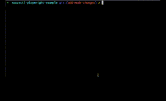

# saucectl playwright example

Example running saucectl with playwright.

## What You'll Need

The steps below illustrate one of the quickest ways to get set up. If you'd like a more in-depth guide, please check out
our [documentation](https://docs.saucelabs.com/dev/cli/saucectl/#installing-saucectl).

### Install `saucectl`

```shell
npm install saucectl -D
```

### Set Your Sauce Labs Credentials

```shell
saucectl configure
```

## Running The Examples
Simply check out this repo and run the command below :rocket:

3 test suites are being triggered in `docker` and `sauce` mode. `saucectl` will run the suites marked as `docker` mode firstly and then run the suites which are marked as `sauce` mode.

Running saucectl in Sauce cloud

```bash
saucectl run
```



Running saucectl in US and EU

```bash
npm run test.sauce.us
```

```bash
npm run test.sauce.eu
```

## The Config

[Follow me](.sauce/config.yml) if you'd like to see how saucectl is configured for this repository.

Our IDE Integrations (e.g. [Visual Studio Code](https://docs.saucelabs.com/dev/cli/saucectl/usage/ide/vscode)) can help you out by validating the YAML files and provide handy suggestions, so make sure to check them out!
